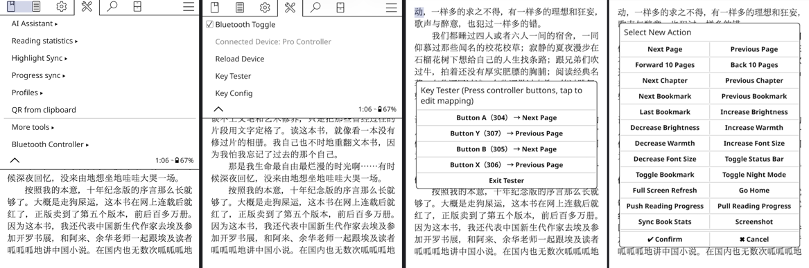

## Kindle Bluetooth Controller for KOReader

[🇨🇳 中文文档](README_CN.md)

A KOReader plugin that enables Bluetooth game controllers / remote controllers to control your Kindle — page turning, brightness adjustment, chapter navigation, and more.

### Features

- **Bluetooth Control** — Toggle Bluetooth on/off directly from KOReader menu
- **Fully Customizable Key Mapping** — Map any controller button or joystick axis to 20+ actions
- **Multi-Action Support** — Bind multiple actions to a single button press
- **Key Tester** — Real-time detection of controller button codes with instant mapping
- **Auto Reconnect** — Automatically detects and reloads device within 3 seconds after Bluetooth reconnection
- **Unmapped Key Alert** — Shows a brief notification when an unmapped button is pressed
- **Gesture Integration** — All functions can be bound to KOReader gestures
- **Persistent Settings** — User-modified mappings are saved separately from default config

### Screenshots



### Supported Actions

| Action | Description |
|--------|-------------|
| `next_page` / `prev_page` | Turn page forward / backward |
| `fast_next_page` / `fast_prev_page` | Skip 10 pages forward / backward |
| `next_chapter` / `prev_chapter` | Jump to next / previous chapter |
| `next_bookmark` / `prev_bookmark` | Navigate between bookmarks |
| `last_bookmark` | Jump to the latest bookmark |
| `increase_brightness` / `decrease_brightness` | Adjust screen brightness |
| `increase_warmth` / `decrease_warmth` | Adjust warm light temperature |
| `increase_font_size` / `decrease_font_size` | Change font size |
| `toggle_night_mode` | Toggle night mode |
| `toggle_statusbar` | Show / hide status bar |
| `toggle_bookmark` | Add / remove bookmark |
| `full_refresh` | Force full screen refresh (E-Ink) |
| `go_home` | Return to home screen |
| `push_progress` / `pull_progress` | Sync reading progress (KOSync) |
| `sync_book_stat` | Sync reading statistics |

### Prerequisites: Kindle Bluetooth Pairing

> ⚠️ **Important**: Kindle's native system does not support connecting non-audio Bluetooth devices. Special configuration is required to connect Bluetooth keyboards or game controllers. Currently only Classic (BR/EDR) Bluetooth is supported — **BLE (Bluetooth Low Energy) is NOT supported**.

Before using this plugin, you need to pair your Kindle with a Bluetooth controller. Since Kindle does not have a native Bluetooth pairing UI, this must be done via command line.

For a detailed pairing guide, see: [Kindle Bluetooth Pairing Guide (MobileRead)](https://www.mobileread.com/forums/showthread.php?t=369712)

### Installation

1. Download the latest release from [Releases](https://github.com/qiuyukang/kindlebtcontroller.koplugin/releases)
2. Extract and copy the `kindlebtcontroller.koplugin` directory to KOReader's plugin directory:

```bash
cp -r kindlebtcontroller.koplugin /mnt/us/koreader/plugins/
```

3. Restart KOReader

### Configuration

#### Default Config (`config.lua`)

The default configuration ships with mappings for a typical Bluetooth gamepad:

```lua
return {
    device_path = "/dev/input/event2",

    key_map = {
        [304] = "next_page",    -- BTN_A
        [305] = "next_page",    -- BTN_B
        [306] = "prev_page",    -- BTN_C
        [307] = "prev_page",    -- BTN_X
        -- ... more mappings
    },

    joy_map = {
        [16] = {                -- D-Pad horizontal
            [-1] = "decrease_brightness",
            [1] = "increase_brightness",
        },
        [17] = {                -- D-Pad vertical
            [-1] = "decrease_warmth",
            [1] = "increase_warmth",
        },
    },
}
```

#### Finding Your Device Path

The default device path is `/dev/input/event2`. If your controller uses a different path, you can find it by running:

```bash
ls /dev/input
```

Look for your Bluetooth device and note the event number.

#### Customizing Mappings

You have two options:

1. **Via UI** — Use the "Key Config" menu in KOReader to view, add, edit, or delete mappings. Changes are saved to `settings/kindlebtcontroller.lua` and persist across restarts.

2. **Via config file** — Edit `config.lua` directly for default mappings. User changes made through the UI are stored separately and override defaults.

### Usage

After installation, find "Bluetooth Controller" in the KOReader menu under Tools.

#### Menu Options

- **Bluetooth Toggle** — Toggle Bluetooth on/off
- **Connected Device** — Shows the currently connected device name
- **Reload Device** — Manually reload the Bluetooth input device
- **Key Tester** — Enter key detection mode to identify button codes
- **Key Config** — View and edit all key mappings

#### Key Detection Mode

1. Open "Key Tester" from the menu
2. Press buttons on your controller — each press shows the key name, code, and current mapping
3. Tap any detected key to add or edit its mapping directly
4. Tap "Exit Tester" to exit

#### Gesture Bindings

The following actions are available in KOReader's gesture settings (under "Device"):

- Toggle Bluetooth
- Reload Bluetooth Device
- Key Tester
- Key Config

### File Structure

```
kindlebtcontroller.koplugin/
├── _meta.lua                    # Plugin metadata
├── main.lua                     # Core plugin logic
├── config.lua                   # Default key mappings
├── bluetooth_state_manager.lua  # Bluetooth state singleton
├── gettext_btcontroller.lua     # i18n loader
├── l10n/                        # Translation files
│   └── en/
│       └── kindlebtcontroller.po
├── README.md                    # Chinese documentation
└── README_EN.md                 # English documentation
```

### Requirements

- **Device**: Amazon Kindle (Bluetooth-capable)
- **Software**: KOReader
- **Controller**: Any Bluetooth HID gamepad or remote (Classic BR/EDR Bluetooth only)

> 📝 **Compatibility Note**: This plugin has been tested and verified on **Kindle 2024**, **Kindle Paperwhite 5 (KPW5)**, and **Kindle Paperwhite 6 (KPW6)**. Newer Kindle models should theoretically be supported as well.

### How It Works

The plugin registers an input event hook via KOReader's `Device.input:registerEventAdjustHook()`. When a Bluetooth controller sends `EV_KEY` (button) or `EV_ABS` (joystick) events, the hook intercepts them, looks up the configured mapping, and dispatches the corresponding KOReader action.

A background watcher polls for device reconnection every 2 seconds. When a previously disconnected device reappears, it automatically reloads the input device and shows a notification.

### Troubleshooting

- **Controller not detected**: Check `device_path` in config. Use `ls /dev/input` to find the correct event path.
- **Buttons not working**: Use "Key Tester" to verify button codes, then check mappings in "Key Config".
- **Bluetooth won't turn on**: Ensure your Kindle model supports Bluetooth. Try toggling from Kindle's native settings first.
- **Debug logs**: Search for `BT Plugin` in KOReader's `crash.log` for detailed event logs.

### Localization

The plugin's default language is Chinese. When KOReader's UI language is set to English or another translated language, the plugin interface automatically switches to that language.

Currently supported languages:
- 🇨🇳 Chinese (default)
- 🇬🇧 English

Contributions for other languages are welcome! Simply create a language folder under `l10n/` (e.g., `ja`, `ko`) and add a `kindlebtcontroller.po` translation file.

### License

MIT

### Author

**qiuyukang**
