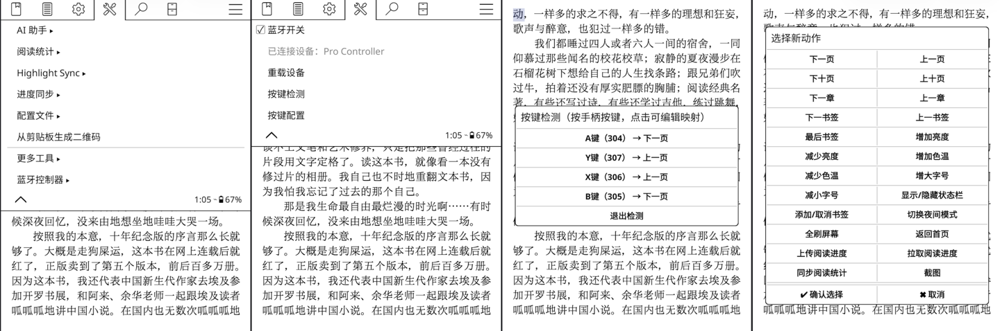

## Kindle 蓝牙控制器 — KOReader 插件

[🇬🇧 English](README_EN.md)

一个 KOReader 插件，让你可以用蓝牙手柄/遥控器控制 Kindle 阅读 —— 翻页、调节亮度、跳转章节等。

### 功能特性

- **蓝牙控制** — 在 KOReader 菜单中直接开关蓝牙
- **完全自定义按键映射** — 将手柄按键或摇杆轴映射到 20+ 种动作
- **多动作绑定** — 单个按键可同时触发多个动作
- **按键检测** — 实时检测手柄按键码，支持直接在检测界面添加/编辑映射
- **自动重连** — 蓝牙重连后 3 秒内自动检测并重载设备
- **未映射提示** — 按下未配置的按键时弹出提示，方便发现遗漏
- **手势集成** — 所有功能均可绑定到 KOReader 手势
- **配置持久化** — 用户修改的映射独立保存，不影响默认配置

### 界面截图



### 支持的动作

| 动作 ID | 说明 |
|---------|------|
| `next_page` / `prev_page` | 下一页 / 上一页 |
| `fast_next_page` / `fast_prev_page` | 下十页 / 上十页 |
| `next_chapter` / `prev_chapter` | 下一章 / 上一章 |
| `next_bookmark` / `prev_bookmark` | 下一书签 / 上一书签 |
| `last_bookmark` | 最后书签 |
| `increase_brightness` / `decrease_brightness` | 增加/减少亮度 |
| `increase_warmth` / `decrease_warmth` | 增加/减少色温 |
| `increase_font_size` / `decrease_font_size` | 增加/减小字号 |
| `toggle_night_mode` | 切换夜间模式 |
| `toggle_statusbar` | 显示/隐藏状态栏 |
| `toggle_bookmark` | 添加/取消书签 |
| `full_refresh` | 全刷屏幕（E-Ink） |
| `go_home` | 返回首页 |
| `push_progress` / `pull_progress` | 上传/拉取阅读进度（KOSync） |
| `sync_book_stat` | 同步阅读统计 |

### 前置准备：Kindle 蓝牙配对

> ⚠️ **重要提示**：Kindle 原生系统不支持连接非音频蓝牙设备，需要进行特殊配置后才可以连接蓝牙键盘或手柄。当前仅支持经典 Classic（BR/EDR）蓝牙，**不支持低功耗 BLE 蓝牙**。

在使用本插件之前，需要先让 Kindle 与蓝牙控制器完成配对。Kindle 原生系统没有蓝牙配对界面，需要通过命令行操作。

详细的蓝牙配对教程请参考：[Kindle Bluetooth Pairing Guide (MobileRead)](https://www.mobileread.com/forums/showthread.php?t=369712)

### 安装

1. 从 [Releases](https://github.com/qiuyukang/kindlebtcontroller.koplugin/releases) 下载最新版本的压缩包
2. 解压后将 `kindlebtcontroller.koplugin` 目录复制到 KOReader 插件目录：

```bash
cp -r kindlebtcontroller.koplugin /mnt/us/koreader/plugins/
```

3. 重启 KOReader

### 配置

#### 默认配置（`config.lua`）

默认配置包含了一个典型蓝牙手柄的按键映射：

```lua
return {
    device_path = "/dev/input/event2",

    key_map = {
        [304] = "next_page",    -- BTN_A
        [305] = "next_page",    -- BTN_B
        [306] = "prev_page",    -- BTN_C
        [307] = "prev_page",    -- BTN_X
        -- ... 更多映射
    },

    joy_map = {
        [16] = {                -- 十字键水平方向
            [-1] = "decrease_brightness",
            [1] = "increase_brightness",
        },
        [17] = {                -- 十字键垂直方向
            [-1] = "decrease_warmth",
            [1] = "increase_warmth",
        },
    },
}
```

#### 查找设备路径

默认设备路径为 `/dev/input/event2`。如果你的手柄使用不同的路径，可以通过以下命令查找：

```bash
ls /dev/input
```

找到你的蓝牙设备对应的 event 编号。

#### 自定义映射

有两种方式：

1. **通过界面** — 在 KOReader 菜单中使用「按键配置」查看、添加、编辑或删除映射。修改会保存到 `settings/kindlebtcontroller.lua`，重启后依然生效。

2. **通过配置文件** — 直接编辑 `config.lua` 修改默认映射。通过界面修改的配置独立存储，会覆盖默认值。

### 使用方法

安装后，在 KOReader 菜单的设备设置中找到「蓝牙控制器」。

#### 菜单选项

- **蓝牙开关** — 开启/关闭蓝牙
- **已连接设备** — 显示当前连接的设备名称
- **重载设备** — 手动重新加载蓝牙输入设备
- **按键检测** — 进入按键检测模式，识别手柄按键码
- **按键配置** — 查看和编辑所有按键映射

#### 按键检测模式

1. 从菜单打开「按键检测」
2. 按下手柄按键 —— 每次按键会显示按键名称、键码和当前映射
3. 点击任意检测到的按键，可直接添加或编辑映射
4. 点击「退出检测」退出

#### 手势绑定

以下动作可在 KOReader 手势设置的「设备」分类中找到：

- 开/关蓝牙
- 重载蓝牙设备
- 按键检测
- 按键配置

### 文件结构

```
kindlebtcontroller.koplugin/
├── _meta.lua                    # 插件元信息
├── main.lua                     # 核心插件逻辑
├── config.lua                   # 默认按键映射
├── bluetooth_state_manager.lua  # 蓝牙状态管理单例
├── gettext_btcontroller.lua     # 多语言加载器
├── l10n/                        # 翻译文件目录
│   └── en/
│       └── kindlebtcontroller.po
├── README.md                    # 中文文档
└── README_EN.md                 # English documentation
```

### 环境要求

- **设备**：Amazon Kindle（需支持蓝牙）
- **软件**：KOReader
- **控制器**：任意蓝牙 HID 手柄或遥控器（仅支持经典 BR/EDR 蓝牙）

> 📝 **兼容性说明**：本插件目前仅在 **Kindle 2024**、**Kindle Paperwhite 5 (KPW5)**、**Kindle Paperwhite 6 (KPW6)** 上测试验证通过。理论上更新版本的 Kindle 也是支持的。

### 工作原理

插件通过 KOReader 的 `Device.input:registerEventAdjustHook()` 注册输入事件钩子。当蓝牙手柄发送 `EV_KEY`（按键）或 `EV_ABS`（摇杆）事件时，钩子拦截事件，查找配置的映射，并分发对应的 KOReader 动作。

后台每 2 秒轮询一次设备状态。当检测到之前断开的设备重新出现时，自动重载输入设备并弹出通知。

### 常见问题

- **手柄未检测到**：检查配置中的 `device_path`，使用 `ls /dev/input` 查找正确的 event 路径。
- **按键无反应**：使用「按键检测」确认按键码，然后在「按键配置」中检查映射。
- **蓝牙无法开启**：确认你的 Kindle 型号支持蓝牙，先尝试在 Kindle 原生设置中开关蓝牙。
- **调试日志**：在 KOReader 的 `crash.log` 中搜索 `BT Plugin` 查看详细事件日志。

### 多语言支持

插件默认语言为中文。当 KOReader 的界面语言设置为英文或其他已翻译的语言时，插件界面会自动切换为对应语言。

目前支持的语言：
- 🇨🇳 中文（默认）
- 🇬🇧 English

欢迎贡献其他语言的翻译！只需在 `l10n/` 目录下创建对应语言的文件夹（如 `ja`、`ko`），并添加 `kindlebtcontroller.po` 翻译文件即可。

### 许可证

MIT

### 作者

**qiuyukang**
