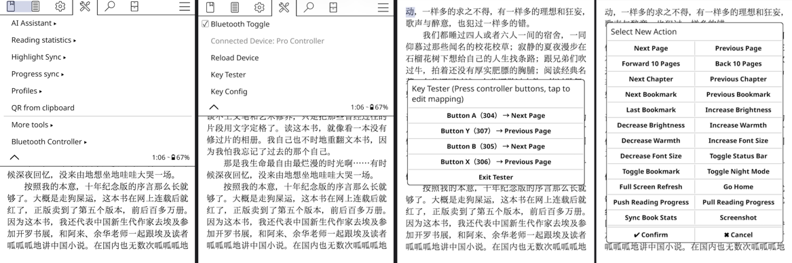
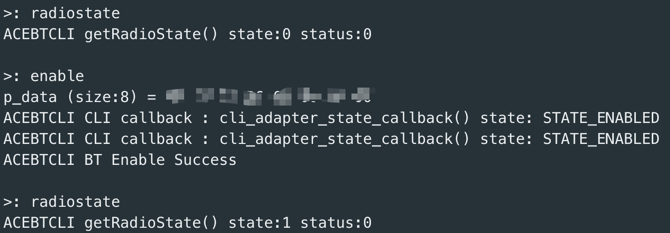
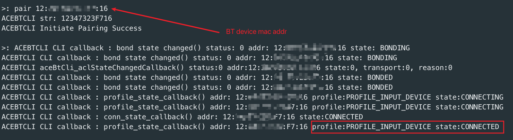
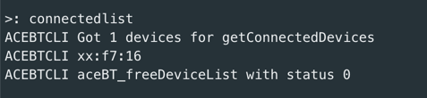
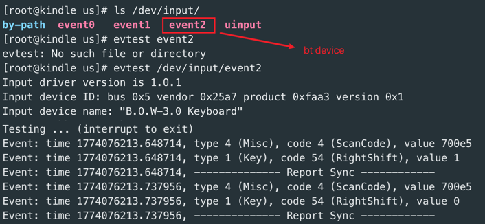
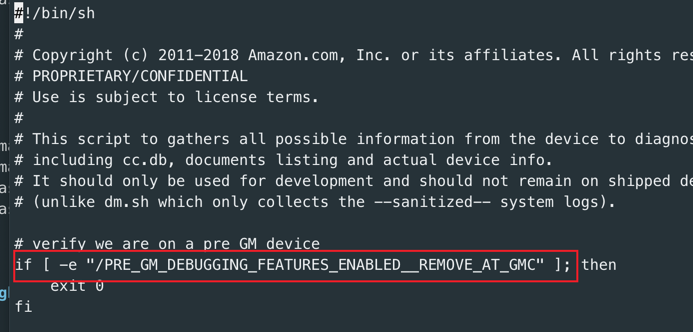

## Kindle Bluetooth Controller for KOReader

[🇨🇳 中文文档](README_CN.md)

A KOReader plugin that enables Bluetooth game controllers / remote controllers to control your Kindle — page turning, brightness adjustment, chapter navigation, and more.

### Features

- **Bluetooth Control** — Toggle Bluetooth on/off directly from KOReader menu
- **Fully Customizable Key Mapping** — Map any controller button or joystick axis to 20+ actions
- **Multi-Action Support** — Bind multiple actions to a single button press
- **Key Tester** — Real-time detection of controller button codes with instant mapping
- **Auto Reconnect** — Automatically detects and reloads device within 3 seconds after Bluetooth reconnection
- **Unmapped Key Alert** — Shows a brief notification when an unmapped button is pressed
- **Gesture Integration** — All functions can be bound to KOReader gestures
- **Persistent Settings** — User-modified mappings are saved separately from default config

### Screenshots



### Supported Actions

| Action | Description |
|--------|-------------|
| `next_page` / `prev_page` | Turn page forward / backward |
| `fast_next_page` / `fast_prev_page` | Skip 10 pages forward / backward |
| `next_chapter` / `prev_chapter` | Jump to next / previous chapter |
| `next_bookmark` / `prev_bookmark` | Navigate between bookmarks |
| `last_bookmark` | Jump to the latest bookmark |
| `increase_brightness` / `decrease_brightness` | Adjust screen brightness |
| `increase_warmth` / `decrease_warmth` | Adjust warm light temperature |
| `increase_font_size` / `decrease_font_size` | Change font size |
| `toggle_night_mode` | Toggle night mode |
| `toggle_statusbar` | Show / hide status bar |
| `toggle_bookmark` | Add / remove bookmark |
| `full_refresh` | Force full screen refresh (E-Ink) |
| `go_home` | Return to home screen |
| `push_progress` / `pull_progress` | Sync reading progress (KOSync) |
| `sync_book_stat` | Sync reading statistics |

### Installation

#### Supported Devices

This plugin has been tested and verified on the following Kindle models:

| Device | Status |
|--------|--------|
| **Kindle 2024** | ✅ Verified |
| **Kindle Paperwhite 11 (KPW5)** | ✅ Verified |
| **Kindle Paperwhite 12 (KPW6)** | ✅ Verified |

> 📝 Newer Kindle models with Bluetooth support should theoretically work as well.
>
> ⚠️ **Warning**: Older Kindle models than those listed above, such as Kindle Oasis 1 (KO) or Kindle Paperwhite 3 (KPW3), are **not supported** by this pairing method and are **not supported** by this plugin. Do **not** follow the Bluetooth pairing steps below on those devices, or the device may enter a white-screen state and require recovery.

#### Requirements

- **Software**: [KOReader](https://github.com/koreader/koreader) installed on your Kindle
- **Controller**: Any Bluetooth HID gamepad or remote
  - With `ace_bt_cli`: Classic BR/EDR Bluetooth only, **BLE is NOT supported**
  - With `kindle-hid-passthrough`: Classic Bluetooth works, and some BLE HID devices can also work

#### Before You Install: Prepare Bluetooth Pairing

> ⚠️ **Important**: Kindle's native system does not support connecting non-audio Bluetooth devices. Special configuration is required to connect Bluetooth keyboards or game controllers.
>
> ⚠️ **Device safety warning**: Do not use the following pairing steps on unsupported older Kindle models, including KO and KPW3. These steps are only intended for the tested models above and newer compatible models. Using them on unsupported devices may cause a white screen and require manual recovery.

Before installing this plugin, you must first pair your Kindle with a Bluetooth controller. You can choose either of the following approaches:

- **Option A: `ace_bt_cli`**
  - Uses the Kindle's native Bluetooth stack
  - Closely matches the pairing flow this plugin was originally designed around
  - Supports Classic BR/EDR Bluetooth devices only
- **Option B: `kindle-hid-passthrough`**
  - Uses a userspace Bluetooth HID stack and exposes input devices through `/dev/uhid`
  - Usually offers better compatibility and can also work with some BLE HID devices
  - While active, it takes over the default Bluetooth stack, so native Kindle Bluetooth features such as audio cannot be used at the same time

References:

- [Kindle Bluetooth Pairing Guide (MobileRead)](https://www.mobileread.com/forums/showthread.php?t=369712)
- [kindle-hid-passthrough](https://github.com/zampierilucas/kindle-hid-passthrough)

<details>
<summary><strong>Option A: Pair with ace_bt_cli (native Bluetooth stack)</strong></summary>

##### 1. Update the Bluetooth Detection Rules

```shell
# After connecting over SSH, switch the system partition to read-write mode.
mntroot rw
mkdir -p /usr/local/bin && cd /usr/local/bin
```

Open the file for editing:

```shell
vi /usr/local/bin/dev_is_keyboard.sh
```

Then paste in the following contents:

```sh
#!/bin/sh
DEVICE=$1
if evtest info $DEVICE | grep -q 'Event type 1 (Key)'; then
  if evtest info $DEVICE | grep -q 'Event code 16 (Q)'; then
    # Don't set these just because Key is supported -- that will
    # detect the touchscreen as a keyboard which breaks the UI
    echo ID_INPUT=1
    echo ID_INPUT_KEY=1
    echo ID_INPUT_KEYBOARD=1
  fi
fi
```

Then save the file and make it executable:

```shell
chmod +x dev_is_keyboard.sh
```

Open the rule file for editing:

```shell
vi /etc/udev/rules.d/99-bt-keyboard.rules
```

Then paste in the following contents:

```sh
KERNEL=="uhid", MODE="0660", GROUP="bluetooth"
ACTION=="add", SUBSYSTEM=="input", IMPORT+="/usr/local/bin/dev_is_keyboard.sh %N"
```

Then reload the udev rules:

```shell
cd /etc/udev/rules.d/
udevadm control --reload-rules && udevadm trigger
```

##### 2. Pair the Bluetooth Device

Run `ace_bt_cli` to open the Bluetooth toolbox. Then run `radiostate` to check whether Bluetooth is enabled:

- If the output is `ACEBTCLI getRadioState() state:1 status:0`, Bluetooth is already enabled and you can start pairing.
- If the output is `ACEBTCLI getRadioState() state:0 status:0`, run `enable` first.



Use `pair {bt_addr}` to pair the device. BLE devices are not supported:



After pressing `Enter`, run `connectedlist` to confirm that the pairing entry appears in the list:



Open another terminal session and run `ls /dev/input/` to locate the Bluetooth input device path. In most cases, it is the last `eventX` device. Then run `evtest {dev_path}` and press buttons on the controller to confirm that input events are reported correctly.



##### 3. Disable Excess Logging

When a non-audio Bluetooth device disconnects, the system may generate a large number of unnecessary log files on disk. To prevent this, create the following marker files:

```shell
cd /mnt/us/ && touch DISABLE_CORE_DUMP && touch DISABLE_CORE_DUMP_ALERT
```

Then invert the CoreDump flag in `/usr/bin/dmcc.sh` by removing the `!` after the first `if` condition:

```shell
vi /usr/bin/dmcc.sh
```



</details>

<details>
<summary><strong>Option B: Pair with kindle-hid-passthrough</strong></summary>

`kindle-hid-passthrough` handles Bluetooth HID in userspace and creates Linux input devices through `/dev/uhid`. For this plugin, that is sufficient: as long as your controller appears under `/dev/input/eventX`, it can be used for key mapping and actions.

Recommended flow:

##### 1. Install kindle-hid-passthrough

Follow the latest instructions from its project page:

- KindleForge install: search for `Kindle HID Passthrough` in KindleForge on the device
- Manual install: download the latest release and extract it to `/mnt/us/kindle_hid_passthrough/`

##### 2. Run the interactive installer

```shell
cd /mnt/us/kindle_hid_passthrough
sh scripts/install.sh
```

The installer can typically help with:

- pairing Bluetooth devices
- installing udev rules
- configuring autostart
- installing the BTManager touchscreen UI

##### 3. Pair your device

Choose one of these:

- Open BTManager on the Kindle touchscreen and pair there
- Or pair over SSH:

```shell
/mnt/us/kindle_hid_passthrough/kindle-hid-passthrough --pair
```

##### 4. Start the daemon

```shell
# If the upstart service was installed
start hid-passthrough

# Or run it directly
/mnt/us/kindle_hid_passthrough/kindle-hid-passthrough --daemon
```

##### 5. Confirm that input devices appear

```shell
ls /dev/input
evtest /dev/input/eventX
```

Once button presses show up correctly, return to this plugin and configure key mappings as usual.

> ⚠️ **Note**: While `kindle-hid-passthrough` is active, it replaces the native Bluetooth stack. If you rely on native Kindle Bluetooth features such as audio, you may prefer the `ace_bt_cli` approach instead.
</details>

### Install the Plugin

1. Download the latest release from [Releases](https://github.com/qiuyukang/kindlebtcontroller.koplugin/releases)
2. Extract and copy the `kindlebtcontroller.koplugin` directory to KOReader's plugin directory:

```bash
cp -r kindlebtcontroller.koplugin /mnt/us/koreader/plugins/
```

3. Restart KOReader

### Configuration

#### Default Config (`config.lua`)

The default configuration ships with mappings for a typical Bluetooth gamepad:

```lua
return {
    device_path = "/dev/input/event2",

    key_map = {
        [304] = "next_page",    -- BTN_A
        [305] = "next_page",    -- BTN_B
        [306] = "prev_page",    -- BTN_C
        [307] = "prev_page",    -- BTN_X
        -- ... more mappings
    },

    joy_map = {
        [16] = {                -- D-Pad horizontal
            [-1] = "decrease_brightness",
            [1] = "increase_brightness",
        },
        [17] = {                -- D-Pad vertical
            [-1] = "decrease_warmth",
            [1] = "increase_warmth",
        },
    },
}
```

#### Finding Your Device Path (Advanced / Troubleshooting)

The sample default path is `/dev/input/event2`. In most cases, you no longer need to change this path manually; it is only useful when troubleshooting.

After your Bluetooth controller is connected, run:

```bash
ls /dev/input
```

You will see multiple `eventX` files (where X is a number). The Bluetooth controller is **usually the one with the highest number** — it is the most recently added input device.

> ⚠️ **Warning**: Do NOT configure the wrong event path! Other `eventX` files belong to the touchscreen, buttons, or other system devices. Configuring the wrong path may cause unexpected behavior (e.g., intercepting touchscreen or power button events). If unsure, try disconnecting the Bluetooth controller and running `ls /dev/input` again — the event file that disappears is the one belonging to your controller.

#### Customizing Mappings

You have two options:

1. **Via UI** — Use the "Key Config" menu in KOReader to view, add, edit, or delete mappings. Changes are saved to `settings/kindlebtcontroller.lua` and persist across restarts.

2. **Via config file** — Edit `config.lua` directly for default mappings. User changes made through the UI are stored separately and override defaults.

### Usage

After installation, find "Bluetooth Controller" in the KOReader menu under Tools.

#### Menu Options

- **Bluetooth Toggle** — Toggle Bluetooth on/off
- **Current Device** — Shows the device currently used to control Kindle
- **Paired Bluetooth Devices** — Shows paired devices and device details
- **Reload Device** — Manually reload the Bluetooth input device
- **Key Tester** — Enter key detection mode to identify button codes
- **Key Config** — View and edit all key mappings

#### Key Detection Mode

1. Open "Key Tester" from the menu
2. Press buttons on your controller — each press shows the key name, code, and current mapping
3. Tap any detected key to add or edit its mapping directly
4. Tap "Exit Tester" to exit

#### Gesture Bindings

The following actions are available in KOReader's gesture settings (under "Device"):

- Toggle Bluetooth
- Reload Bluetooth Device
- Key Tester
- Key Config

### File Structure

```
kindlebtcontroller.koplugin/
├── _meta.lua                    # Plugin metadata
├── main.lua                     # Core plugin logic
├── config.lua                   # Default key mappings
├── bluetooth_state_manager.lua  # Bluetooth state singleton
├── gettext_btcontroller.lua     # i18n loader
├── l10n/                        # Translation files
│   └── en/
│       └── kindlebtcontroller.po
├── README.md                    # English documentation
└── README_CN.md                 # Chinese documentation
```

### How It Works

The plugin registers an input event hook via KOReader's `Device.input:registerEventAdjustHook()`. When a Bluetooth controller sends `EV_KEY` (button) or `EV_ABS` (joystick) events, the hook intercepts them, looks up the configured mapping, and dispatches the corresponding KOReader action.

A background watcher polls for device reconnection every 2 seconds. When a previously disconnected device reappears, it automatically reloads the input device and shows a notification.

### Troubleshooting

- **Controller not detected**: Make sure the Bluetooth device is connected. For troubleshooting, use `ls /dev/input` to check whether a new `eventX` device appears.
- **Buttons not working**: Use "Key Tester" to verify button codes, then check mappings in "Key Config".
- **Bluetooth won't turn on**: Ensure your Kindle model supports Bluetooth. Try toggling from Kindle's native settings first.
- **Debug logs**: Search for `BT Plugin` in KOReader's `crash.log` for detailed event logs.

### Localization

The plugin's default language is Chinese. When KOReader's UI language is set to English or another translated language, the plugin interface automatically switches to that language.

Currently supported languages:
- 🇨🇳 Chinese (default)
- 🇬🇧 English

Contributions for other languages are welcome! Simply create a language folder under `l10n/` (e.g., `ja`, `ko`) and add a `kindlebtcontroller.po` translation file.

### License

MIT

### Author

**qiuyukang**
